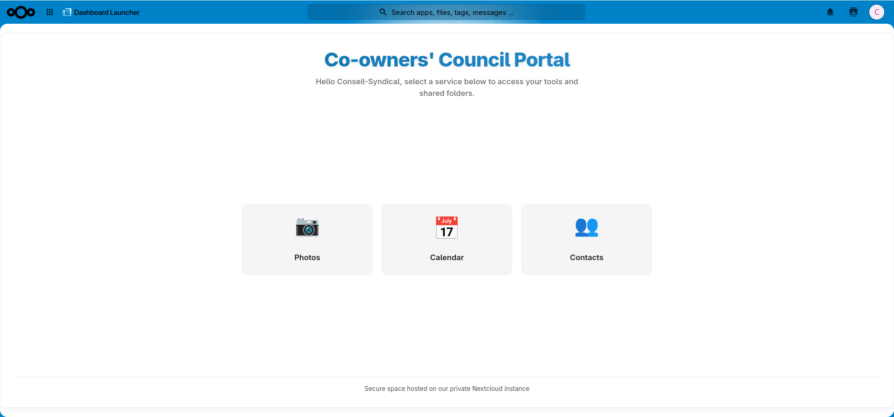
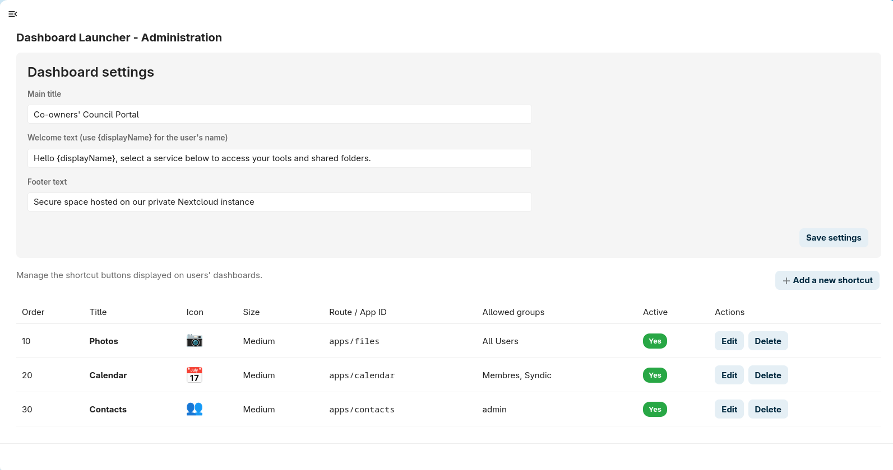

# Dashboard Launcher

A fully customizable, button-driven dashboard for Nextcloud. Create shortcut buttons to any page, app, or external link — configurable entirely from the admin panel, no coding required.



## Features

- **Fully admin-configurable** — create, edit, reorder, and organize shortcut buttons directly from Nextcloud admin settings.
- **Custom icon library** — upload your own icons, pick from a built-in icon library, or use emoji, with adjustable icon sizes per button.
- **Group-based visibility** — show or hide each button based on Nextcloud user groups.
- **Custom branding** — configurable title, welcome message, and footer text.
- **Responsive design** — automatically switches to a compact grid on mobile devices.
- **Bilingual (EN/FR)** — full interface translation, more languages welcome via contributions.

## Use cases

- Internal company or team portals
- Associations, clubs, or co-owner boards (*syndic*/*conseil syndical*)
- Personal or family dashboards linking to shared folders and services
- Landing pages for a specific department or project

## Screenshots

| Dashboard | Admin panel |
|---|---|
|  |  |

## Installation

### From the Nextcloud App Store

Search for "Dashboard Launcher" in **Apps** on your Nextcloud instance, or visit the [app page](https://apps.nextcloud.com/apps/dashboardlauncher).

### Manual installation

1. Download or clone this repository into your Nextcloud `custom_apps` (or `apps`) directory:
   ```bash
   git clone https://github.com/YOUR_USERNAME/dashboardlauncher.git /path/to/nextcloud/custom_apps/dashboardlauncher
   ```
2. Enable the app:
   ```bash
   occ app:enable dashboardlauncher
   ```
3. Go to **Settings → Administration → Dashboard Launcher** to configure your buttons.

## Configuration

All configuration is done through **Settings → Administration → Dashboard Launcher**:

- **Dashboard settings**: main title, welcome text (supports `{displayName}` placeholder), footer text.
- **Shortcuts**: for each button, set a title, icon (upload, library, or emoji), size, target route/URL, display order, allowed groups, and active status.

## Requirements

- Nextcloud 25 or later
- PHP 8.1 or later

## Development

This app follows the standard Nextcloud app structure:

```
dashboardlauncher/
├── appinfo/          # info.xml, routes.php
├── css/               # stylesheets
├── img/               # icons, app.svg, built-in icon library
├── js/                # frontend logic (admin panel, loader)
├── lib/               # PHP backend (Controllers, Migration, Service, Settings)
├── l10n/              # translation catalogs
└── templates/         # PHP templates
```

Contributions are welcome — feel free to open an issue or pull request.

## License

This project is licensed under the [GNU Affero General Public License v3.0](LICENSE).

## Author

DPFPIC
